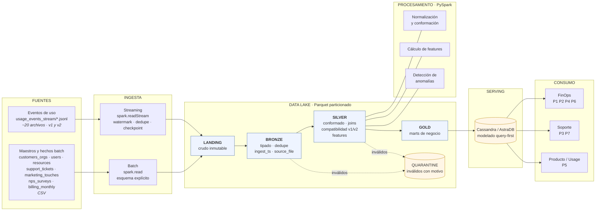
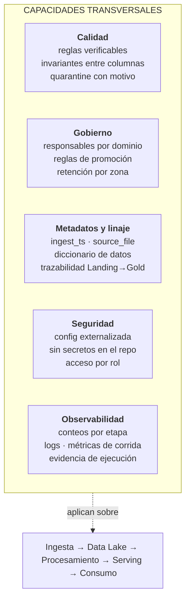
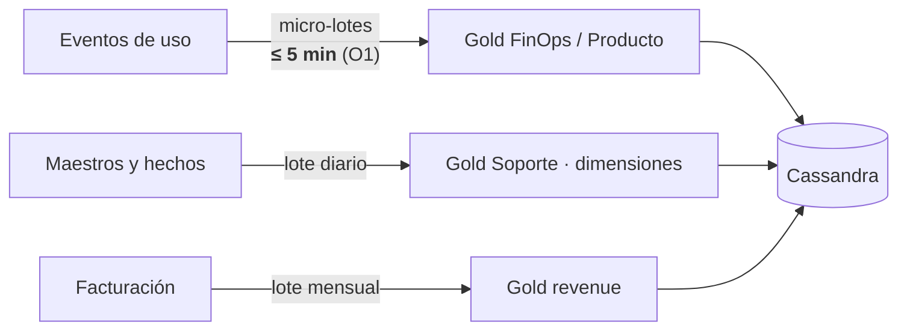

# Diagrama de arquitectura — v1

**Versión**: 1.0 · **Fecha**: 2026-09-20 · **Estado**: propuesta para la 1.ª entrega

Este diagrama representa la arquitectura **propuesta**, no una implementación
existente. Se versiona junto con el código y debe actualizarse en la 2.ª entrega
para reflejar lo efectivamente construido, según exige el criterio de aceptación
"el diagrama representa lo implementado y no componentes meramente aspiracionales".

---

## Vista general

## Capacidades transversales

Atraviesan todas las etapas de la cadena y no son una etapa más.

## Rutas y latencias

## Leyenda de trazabilidad

| Elemento | Responde a |
|---|---|
| Ruta streaming | V-Velocidad · O1 · P1, P2, P5, P6 |
| Ruta batch diaria | V-Variedad · O2 · P3, P7 |
| Ruta batch mensual | V-Veracidad (FX, créditos) · P4 |
| Quarantine | V-Veracidad · O3 |
| Checkpoint + dedupe | O4 |
| Modelado query-first | V-Valor · O5, O6 |
| Silver (compatibilidad v1/v2) | V-Variedad · O8 |

El detalle de cada correspondencia está en la matriz requisito–componente de la §7.
